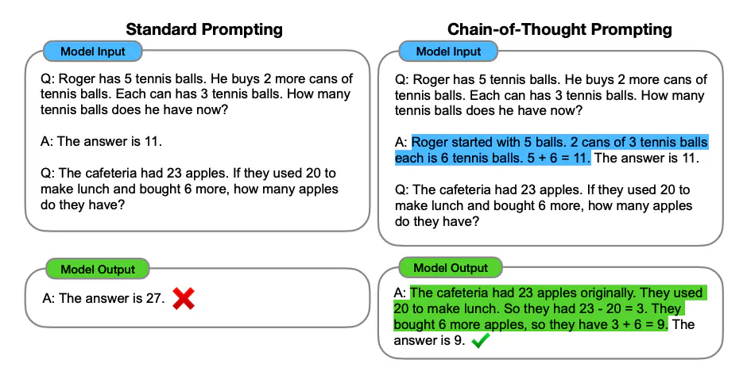
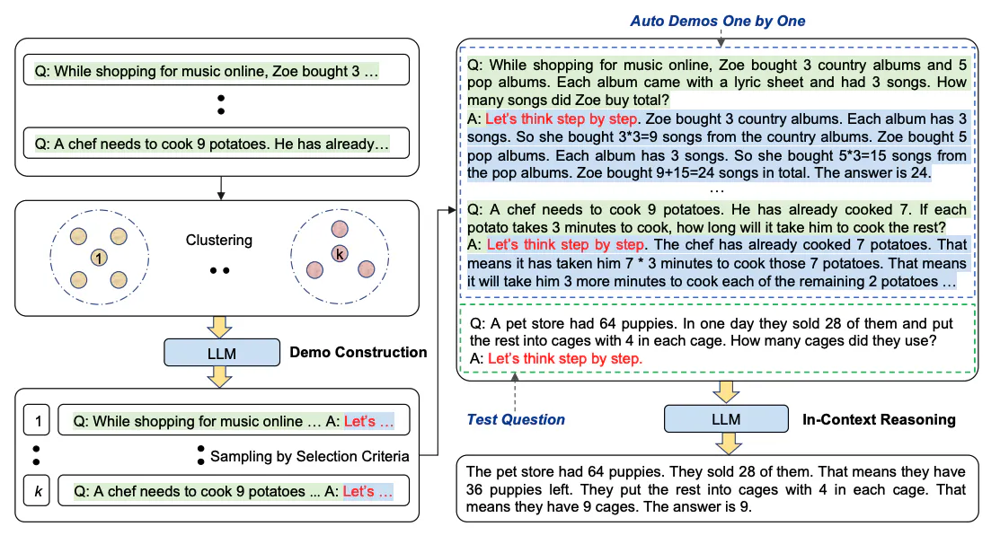
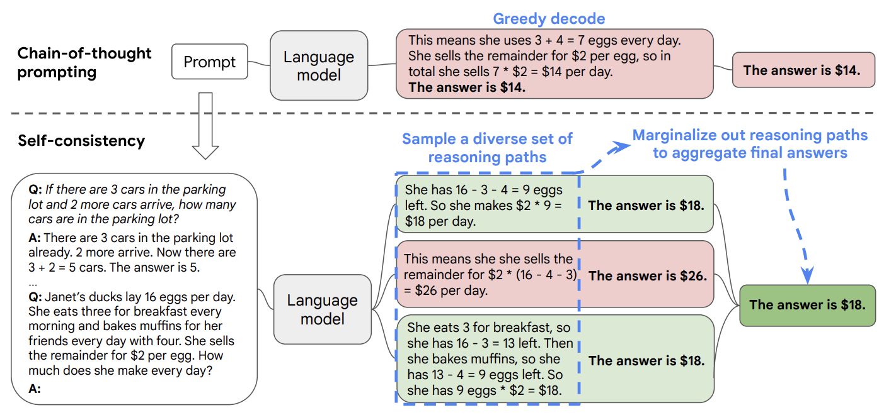
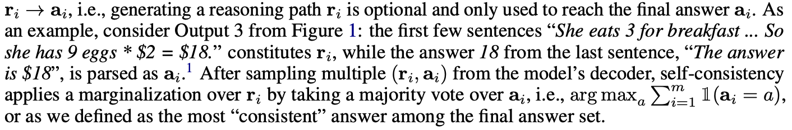
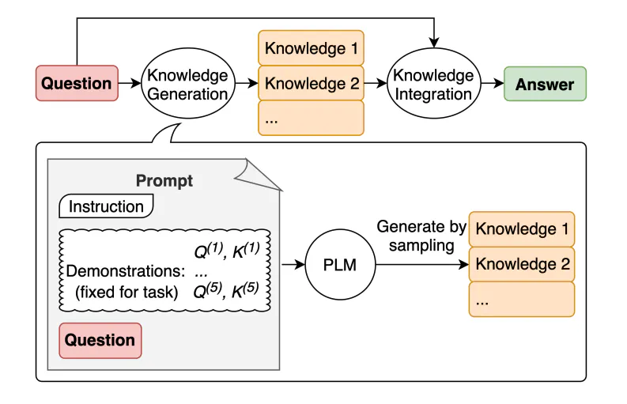
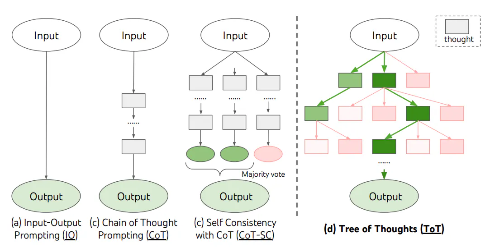
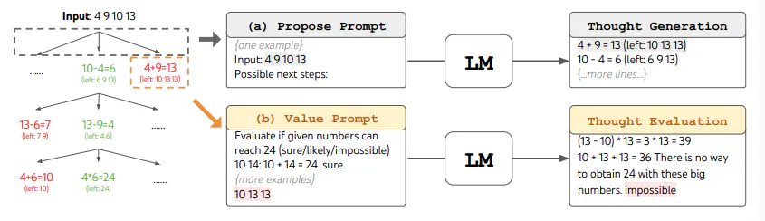

# Zero-shot Prompting

- Zero-shot prompting means that the prompt used to interact with the model won't contain examples or demonstrations.
- Instruction tuning has been shown to improve zero-shot learning. [Wei et al. 2022](https://arxiv.org/pdf/2109.01652)
- Instruction tuning is essentially the concept of finetuning models on datasets described via instructions.

# Few-shot Prompting

- Few-shot prompting can be used as a technique to enable in-context learning where we provide demonstrations in the prompt to steer the model to better performance.
- Tips([Min et al. 2022](https://arxiv.org/abs/2202.12837))
  - The label space and the distribution of the input text specified by the demonstrations are both important.
  - The format you use also plays a key role in performance, even if you just use random labels.
  - Random labels from a true distribution of labels (instead of a uniform distribution) also helps.
- A good case

  - Prompt

    ```text
    // Randomized, kept the format

    This is awesome! // Negative
    This is bad! // Positive
    Wow that movie was rad! // Positive
    What a horrible show! //
    ```

  - Output
    ```text
    Negative
    ```

- Limitations of Few-shot Prompting
  - It is still not a perfect technique, especially when dealing with more complex reasoning tasks.
  - It might help if we break the problem down into steps and demonstrate that to the model. -> chain-of-thought (CoT) prompting

# Chain-of-Thought(CoT) Prompting

Introduced in [Wei et al. (2022)](https://arxiv.org/abs/2201.11903), chain-of-thought (CoT) prompting enables complex reasoning capabilities through intermediate reasoning steps



## 1. Zero-shot CoT Prompting

- [Kojima et al. (2022)](https://arxiv.org/abs/2205.11916) showed that just adding "Let's think step by step" to the original prompt can improve the reasoning capabilities of the model.
- An example
  - Prompt
    ```text
    I went to the market and bought 10 apples.
    I gave 2 apples to the neighbor and 2 to the repairman.
    I then went and bought 5 more apples and ate 1.
    How many apples did I remain with?
    Let's think step by step.
    ```
  - Output
    ```text
    First, you started with 10 apples.
    You gave away 2 apples to the neighbor and 2 to the repairman, so you had 6 apples left.
    Then you bought 5 more apples, so now you had 11 apples.
    Finally, you ate 1 apple, so you would remain with 10 apples.
    ```

## 2. Automatic Chain-of-Thought (Auto-CoT)

- [Zhang et al. (2022)](https://arxiv.org/abs/2210.03493) propose an approach to leverage LLMs with "Let's think step by step" prompt to generate reasoning chains.
- To mitigate effects of mistakes in the generated chains, the diversity of demonstrations matters.



1. Question clustering: partition questions of a given dataset into a few clusters
2. Demonstration sampling: select a representative question from each cluster and generate its reasoning chain using Zero-Shot-CoT with simple heuristics

# Self-Consistency

- Proposed by [Wang et al. (2022)](https://arxiv.org/abs/2203.11171), self-consistency aims "to replace the naive greedy decoding used in chain-of-thought prompting".
- The idea is to sample multiple, diverse reasoning paths through few-shot CoT, and select the most consistent answer.



1. A language model is prompted with a set of manually written chain-of-thought exemplars.
2. We sample a set of candidate outputs from the language model’s decoder, using sampling algorithms, including temperature sampling, top-k sampling, and nucleus sampling.
3. We aggregate the answers by marginalizing out the sampled reasoning paths and taking a majority vote directly over each answer to choose the most consistent answers.

- An example in the paper
  

# Generated Knowledge Prompting



- Proposed by [Liu et al. (2022)](https://arxiv.org/pdf/2110.08387), It consists of generating knowledge from a language model, then providing the knowledge as additional input when answering a question.

  1. using few-shot demonstrations to generate questionrelated knowledge statements from a language model.
  2. using a second language model to make predictions with each knowledge statement, then selecting the highest-confidence prediction.

- Pros

  1. Not require task-specific supervision for knowledge integration, or access to a structured knowledge base.
  2. Improve performance of LLMs on commonsense reasoning tasks.

- An Example

  1. Prompt for generating knowledges

     ```text
     Input: A fish is capable of thinking.
     Knowledge: Fish are more intelligent than they appear. In many areas, such as memory, their cognitive powers match or exceed those of ’higher’ vertebrates including non-human primates. Fish’s long-term memories help them keep track of complex social relationships.
     Input: A common effect of smoking lots of cigarettes in one’s lifetime is a higher than normal chance of getting lung cancer.
     Knowledge: Those who consistently averaged less than one cigarette per day over their lifetime had nine times the risk of dying from lung cancer than never smokers. Among people who smoked between one and 10 cigarettes per day, the risk of dying from lung cancer was nearly 12 times higher than that of never smokers.
     Input: A rock is the same size as a pebble.
     Knowledge: A pebble is a clast of rock with a particle size of 4 to 64 millimetres based on the Udden-Wentworth scale of sedimentology. Pebbles are generally considered larger than granules (2 to 4 millimetres diameter) and smaller than cobbles (64 to 256 millimetres diameter).
     Input: Part of golf is trying to get a higher point total than others.
     Knowledge:
     ```

  2. One of the outputs(knowledges)

     ```text
     The objective of golf is to play a set of holes in the least number of strokes. A round of golf typically consists of 18 holes. Each hole is played once in the round on a standard golf course. Each stroke is counted as one point, and the total number of strokes is used to determine the winner of the game.
     ```

  3. Prompt using the knowledge

     ```text
     Question: Part of golf is trying to get a higher point total than others. Yes or No?
     Knowledge: The objective of golf is to play a set of holes in the least number of strokes. A round of golf typically consists of 18 holes. Each hole is played once in the round on a standard golf course. Each stroke is counted as one point, and the total number of strokes is used to determine the winner of the game.
     Explain and Answer:
     ```

  4. Output

     ```text
     No, the objective of golf is not to get a higher point total than others. Rather, the objective is to play a set of holes in the least number of strokes. The total number of strokes is used to determine the winner of the game, not the total number of points.
     ```

# Prompt Chaining

## 1. What is Prompt Chaining?

- Prompt Chaining is to break tasks into its subtasks, and make use of an output of each subtask as an input of another subtask, creating a chain of prompt operations.
- Pros
  1. Better performance: it is useful to accomplish complex tasks.
  2. Easy to debug: it helps to boost the transparency of your LLM application, increases controllability, and reliability.

## 2. When to use prompt chaining

1. Multi-step tasks: ex) Researching a topic -> outlining an essay -> writing an essay -> formatting an essay
2. Complex instructions: too many instructions or details is hard to follow consistently.
3. Verifying outputs: ex) generating a list of items -> feeding the list back to the LLM and asking if it is correct.
4. Parallel processing: If subtasks are independent each other, it is better to run them in parallel.

## 3. Tips for effective prompt chaining

1. Keep subtasks simple and clear.
2. Use XML tags which help structure inputs/outputs and make it easier to extract and pass on to the next subtask.

## 4. Example

### 4.1. Answering questions using a document and quotes

- Step1: Extracting the quotes

  ```text
  Here is a document, in <document></document> XML tags:

  <document>
  {{DOCUMENT}}
  </document>

  Please extract, word-for-word, any quotes relevant to the question {{QUESTION}}.
  Please enclose the full list of quotes in <quotes></quotes> XML tags.
  If there are no quotes in this document that seem relevant to this question, please say "I can't find any relevant quotes".
  ```

- Step2: Answering the question using the output of step1 as QUOTES

  ```text
  I want you to use a document and relevant quotes from the document to answer a question.

  Here is the document:
  <document>
  {{DOCUMENT}}
  </document>

  Here are direct quotes from the document that are most relevant to the question:
  <quotes>
  {{QUOTES}}
  </quotes>

  Please use these to construct an answer to the question "{{QUESTION}}"

  Ensure that your answer is accurate and doesn't contain any information not directly supported by the quotes.
  ```

### 4.2. Validating outputs(ex. grammatical errors)

- Step1: Generating a list of errors

  ```text
  Here is an article:
  <article>
  {{ARTICLE}}
  </article>

  Please identify any grammatical errors in the article. Please only respond with the list of errors, and nothing else. If there are no grammatical errors, say "There are no errors."
  ```

- Step2: Double checking the list of errors using the output of step1 as ERRORS

  ```text
  Here is an article:
  <article>
  {{ARTICLE}}
  </article>

  Please identify any grammatical errors in the article that are missing from the following list:
  <list>
  {{ERRORS}}
  </list>

  If there are no errors in the article that are missing from the list, say "There are no additional errors."
  ```

### 4.3. Parallel processing

- When explaining a concept to readers at three different levels(1st grade, 8th grade, college freshman),
- Step1: Create an outline(three different levels, one for each level)

  ```text
  Here is a concept: {{CONCEPT}}

  I want you to write a three sentence outline of an essay about this concept that is appropriate for this level of reader: {{LEVEL}}

  Please only respond with your outline, one sentence per line, in <outline></outline> XML tags. Don't say anything else.
  ```

- Step2: Create full explanations using the output of step1 as OUTLINE

  ```text
  Here is an outline:
  <outline>
  {{OUTLINE}}
  </outline>

  Please expand each sentence in the outline into a paragraph.
  Use each sentence word-for-word as the first sentence in its corresponding paragraph.
  Make sure to write at a level appropriate for this type of reader: {{LEVEL}}.
  ```

# Tree of Thoughts (ToT)

## 1. What is Tree of Thoughts?

- [Yao et el. (2023)](https://arxiv.org/abs/2305.10601) and [Long (2023)](https://arxiv.org/abs/2305.08291) recently proposed Tree of Thoughts (ToT): CoT prompting + exploration over intermediate thoughts.



- An LLM self-evaluates a reasoning progress through intermediate thoughts, which helps to solve a problem through a deliberate reasoning process.
- The LLM's ability to generate and evaluate thoughts is then combined with search algorithms(BFS, DFS. Beam search, etc.) to explore the possible reasoning paths.

## 2. How does it work?



- [Yao et el. (2023)](https://arxiv.org/abs/2305.10601) applies BFS and ToT to the Game of 24 task, generating 3 steps(layers) and 5 candidates per thoughts(nodes).
- The LLM is prompted to evaluate each thought candidate as "sure/maybe/impossible" with regard to reaching 24, the aim of which is to promote correct partial solutions.

## 3. Variations of ToT

1. RL-based ToT system: [Long (2023)](https://arxiv.org/abs/2305.08291) uses a "ToT Controller" trained from new dataset through reinforcement learning even with a fixed LLM.
2. ToT only with a single prompt: [Hulbert (2023)](https://github.com/dave1010/tree-of-thought-prompting) implements the main concept of ToT with only one prompt. It boosts the ChatGPT 3.5's reasoning to ChatGPT 4.0's in some cases.
   - Prompt
     ```text
     Imagine three different experts are answering this question.
     All experts will write down 1 step of their thinking,
     then share it with the group.
     Then all experts will go on to the next step, etc.
     If any expert realises they're wrong at any point then they leave.
     The question is...
     ```
3. PanelGPT: [Sun (2023)](https://github.com/holarissun/PanelGPT) benchmarked the Tree-of-Thought Prompting with an idea of panel discussions among LLMs.

# Retrieval Augmented Generation (RAG)

- [Retrieval-Augmented Generation for Large Language Models: A Survey](https://arxiv.org/abs/2312.10997)

# Automatic Reasoning and Tool-use (ART)

...

# Refernences

- [Anthropic - Chain prompts](https://docs.anthropic.com/claude/docs/chain-prompts)
- [Official Repo of Tree of Thoughts (ToT)](https://github.com/princeton-nlp/tree-of-thought-llm)
